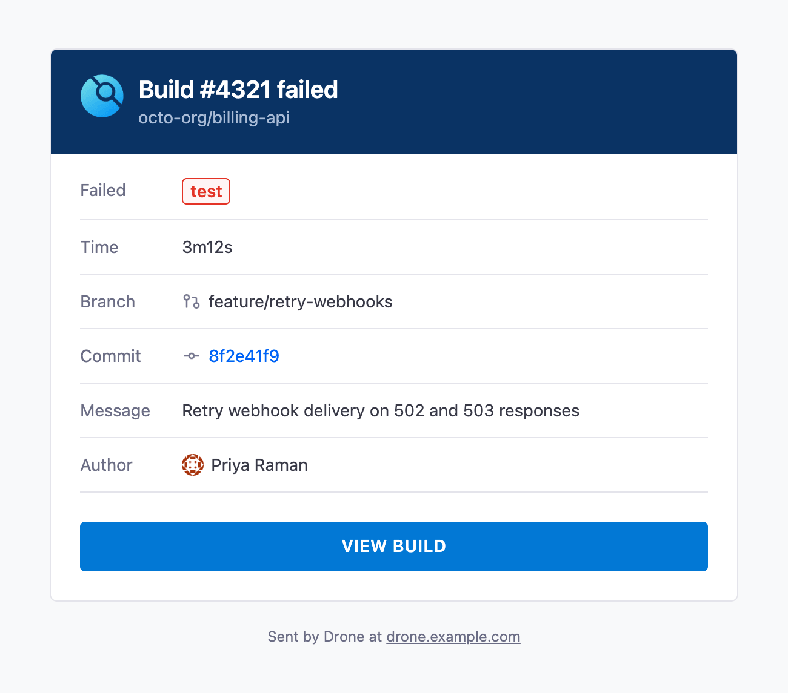
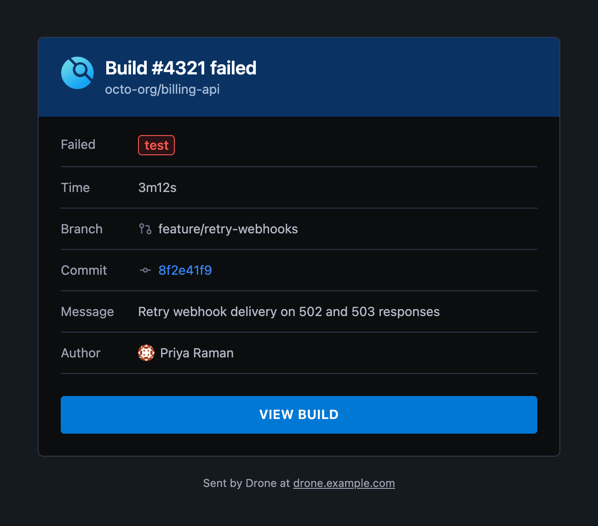

# Drone Email Webhook

A webhook receiver for Drone CI. It verifies Drone's HTTP signature and emails the commit author when a build update reports a failure.

## Quick start

Set `DRONE_SECRET` to the shared signing secret used by Drone. Provide the SMTP host, port, and sender through the host environment; Docker passes them into the container with `--env NAME`.

```sh
docker run --rm \
  --publish 3000:3000 \
  --env DRONE_SECRET \
  --env DRONE_EMAIL_SMTP_HOST \
  --env DRONE_EMAIL_SMTP_PORT \
  --env DRONE_EMAIL_FROM \
  yusoltsev/drone-email-webhook:latest
```

In Drone, set the webhook endpoint to a host reachable by the Drone server and use the same shared secret:

```yaml
DRONE_WEBHOOK_ENDPOINT: "http://drone-email-webhook.example:3000"
DRONE_WEBHOOK_SECRET: "<same shared value as DRONE_SECRET>"
```

See the [Drone webhook setup guide](https://docs.drone.io/webhooks/overview/) for server configuration details. The receiver accepts signed `POST /` requests and exposes `GET /health` for health checks:

```sh
curl --fail http://localhost:3000/health
```

## Configuration

| Variable | Description | Default | Required |
| --- | --- | --- | --- |
| `DRONE_SECRET` | Shared secret for verifying Drone webhook signatures | — | Yes |
| `DRONE_SERVER_HOST` | Address to bind the HTTP server | `0.0.0.0` | Yes |
| `DRONE_SERVER_PORT` | HTTP server port | `3000` | Yes |
| `DRONE_EMAIL_SMTP_HOST` | SMTP server host | `localhost` | Yes |
| `DRONE_EMAIL_SMTP_PORT` | SMTP server port | `25` | Yes |
| `DRONE_EMAIL_SMTP_USERNAME` | SMTP username | — | No |
| `DRONE_EMAIL_SMTP_PASSWORD` | SMTP password | — | No |
| `DRONE_EMAIL_FROM` | Sender address | `drone@localhost` | Yes |
| `DRONE_EMAIL_CC` | Additional CC recipients, comma-separated | — | No |
| `DRONE_EMAIL_BCC` | Additional BCC recipients, comma-separated | — | No |

For SMTP authentication, set both `DRONE_EMAIL_SMTP_USERNAME` and `DRONE_EMAIL_SMTP_PASSWORD` in the host environment and add both with `--env`.

## Email preview

| Light theme | Dark theme |
| :---: | :---: |
|  |  |

## Docker images

Images are published to [Docker Hub](https://hub.docker.com/r/yusoltsev/drone-email-webhook) and [GitHub Container Registry](https://github.com/yegor-usoltsev/drone-email-webhook/pkgs/container/drone-email-webhook).

## License

[MIT](LICENSE)
